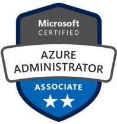
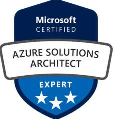
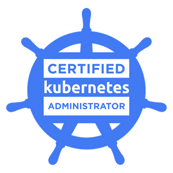
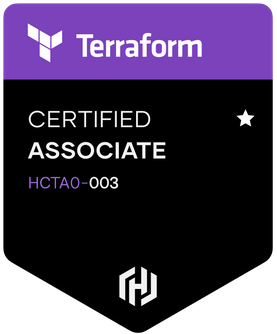
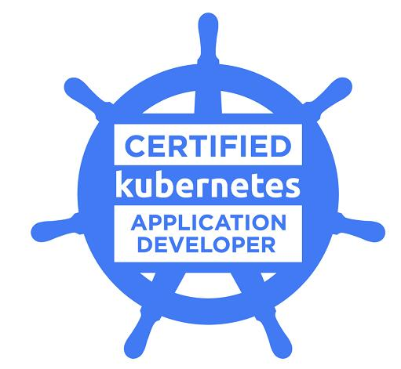

>  style="width:1.22562in;height:1.57569in" /> style="width:1.97778in;height:2.10833in" />**DHANVEER** **AHAMED**
>
> **Email**
>
> **Mobile** **Skype** **Id**
>
> :
> [<u>dhanveer.ahamed@rediffmail.com</u>](mailto:dhanveer.ahamed@rediffmail.com)
> [<u>dhanveerahamed@gmail.com</u>](mailto:dhanveerahamed@gmail.com)

: +971-563548061 : v-9dhaha

> SUMMARY:
>
>  style="width:1.97778in;height:2.06389in" /> style="width:1.97778in;height:1.97778in" /> style="width:1.71528in;height:1.61833in" /> style="width:1.97778in;height:1.82292in" />15+ years’ diverse
> experience in IT Infrastructure Management, DevOps, Private/Public
> Cloud Solutions. Excellent knowledge and rich hands-on experience in
> Planning, Designing, Implementation, Migration, Capacity Planning,
> Upgradation and Maintenance of Server and Application Virtualization,
> Server Consolidation, Cloud Solutions, CI/CD Pipeline Configuration,
> Server Management and Administration.
>
> WORK EXPERIENCE:
>
> **JAN** **2023** **–** **TILL** **DATE**
>
> **DEVOPS** **ENGINEER,** **Vision-Box** **FZE**
>
> **DEC** **2021** **–** **JAN** **2023**
>
> **SR.LINUX** **&** **VIRTUALIZATION** **CONSULTANT,** **AlphaData**
>
> **JUNE** **2019** **–** **NOV** **2021**
>
> **TECHNICAL** **SPECIALIST,** **HCL** **Technologies**
>
> **JANUARY** **2017** **–** **JUNE** **2019**
>
> **SENIOR** **SYSTEMS** **ENGINEER**, **Computer** **Network**
> **Systems**
>
> **SEPTEMBER** **2015** **–** **DECEMBER** **2016** **ENGINEER** **–**
> **IT** **SYSTEMS**, **Al** **Fara’a** **Group**
>
> **AUGUST** **2013** **-** **JULY** **2015**
>
> **ENGINEER** **–** **SYSTEMS,** **Sify** **Technologies**
>
> **NOVEMBER** **2012** **–** **AUGUST** **2013**
>
> **SENIOR** **INFRASTRUCTURE** **ENGINEER,** **Zieta** **Technologies**
>
> **APRIL** **2011** **–** **AUGUST** **2012** **SENIOR** **ASSOCIATE,**
> **Wipro** **Limited**
>
> **DECEMBER** **2009** **–** **APRIL** **2011** **SENIOR** **SUPPORT**
> **ENGINEER,** **CSS** **Corp**
>
> **OCTOBER** **2008** **–** **DECEMBER** **2009**
>
> **TECHNICAL** **SUPPORT** **EXECUTIVE,** **Sutherland** **Global**
> **Services**

TECHNICAL CERTIFICATIONS: **<u>CURRENT CERTIFICATIONS:</u>**

**HASHICORP** **CERTIFIED** **TERRAFORM** **ASSOCIATE** **003** **–**
Issued by Hashicorp – valid till 2025

**CERTIFIED** **KUBERNETES** **ADMINISTRATOR** – Issued by Linux
Foundation – valid till 2026 – Certificate \# LF-4dormg2cp1

**CERTIFIED** **KUBERNETES** **APPLICATION** **DEVELOPER** – Issued by
Linux Foundation – valid till 2027 – Certificate \# LF-qd3a2rs0nc

**MICROSOFT** **CERTIFIED:** **AZURE** **ADMINISTRATOR** **ASSOCIATE** -
MCID: 10926122 – Valid till Jan 2023 **MICROSOFT** **CERTIFIED:**
**AZURE** **SOLUTIONS** **ARCHITECT** **EXPERT** - MCID: 10926122 –
Valid till August 2022

**<u>EXPIRED CERTIFICATIONS:</u>**

**RHCE** **–** **RED** **HAT** **CERTIFIED** **ENGINEER** in Red Hat
Enterprise Linux 7 (Certificate \#: 150-018-471)

**AWS** **SOLUTION** **ARCHITECT** **–** **ASSOCIATE** **LEVEL** **-**
Amazon Web Services Solutions Architect (Certificate \# AWS-ASA-36489)

**VMWARE** **CERTIFIED** **PROFESSIONAL** **–** **DATA** **CENTER**
**VIRTUALIZATION** in VMware VSphere 6 - Candidate ID:
VMW-01402394L-00470874

TECHNICAL SKILLS:

**VIRTUALIZATION** **PLATFORM**

**CONTAINER** **ORCHESTRATION** **SERVER** **HARDWARE** **STORAGE**

**PUBLIC** **CLOUD**

**HYPER** **CONVERGED** **SOLUTIONS** **CONFIGURATION** **MANAGEMENT**
**SCRIPTING**

**DEVOPS** **TOOLS** **MONITORING** **TOOLS** **WEB** **SERVERS**

**:** VMware VSphere (5.5, 6.x, 7.x), Hyper-V

**:** RedHat Enterprise Linux (5, 6, 7, 8), Sun Solaris (5.10, 5.11),
Windows Server **:** Docker Swarm, Kubernetes, RedHat OpenShift

**:** HPE, Dell, Cisco UCS

**:** Dell EMC ECS, NetApp, HPE 3Par

**:** Amazon Web Services, Microsoft Azure **:** Dell VxRail, HPE HC250,
Nutanix

**:** HP Server Automation, RedHat Satellite, Ansible, Puppet **:**
Python, Bash, PowerShell

**:** Git, Jenkins, Build Tools (Maven), Quay, Clair, Packer, Terraform
**:** ELK Stack, Grafana, Graphite

**:** Apache, Nginx, Microsoft IIS

Roles and Responsibilities

➢Install, Configure, Test and Maintain Operating Systems, Business
Applications and System Management Tools ➢Performing Proactive Daily
Health Checks and raising cases with vendors to fix Hardware and
Software Issues. ➢Participating in Migration of VMs from On Premises to
Public Cloud and participated in Design and Implementation.
➢Implementing Automation to manage the Infrastructure with Puppet,
Terraform, PowerShell and Bash Scripts ➢Follow ITIL Process Defined by
the Organization to handle Incidents, Changes, Problems and Service
Requests ➢Follow CIS Benchmark to implement Security in Linux
Environment using Ansible and Windows Environment. ➢Proactively ensuring
the highest levels of Systems and Infrastructure Availability and
Security

➢Liaise with vendors and other IT personnel for problem resolution.
➢Provide 2nd and 3rd level support.

➢Extensive Implementation of LVM, ZFS Pool, Solaris Volume Manager,
Veritas File Systems, iSCSI, FC, NFS, CIFS ➢Preparing and Maintaining
Documentation of the Infrastructure which includes Standard Operating
Procedures, Design Documents, Server Inventory, Capacity Planner,
Password Vault, Licensing Details and Knowledge Base ➢Defined Patching
Strategy and addressed Security Vulnerabilities with Tight Deadlines.

Major Achievements in various organizations

➢Implemented ELK Stack in ADIA (Alphadata), which ingests Syslog,
Filebeat from all servers in the organization. ➢Worked on implementing
Red Hat Quay and Clair for Azure Red Hat Openshift as POC and Azure
Kubernetes

> Service for one of the Tier1 Application.

➢Implemented Central Package Repository Server to eliminate the process
of building local repository in all servers and to avoid to space issues
for Solaris Environment for the client Abu Dhabi Islamic Bank

➢Worked on migration of Virtual Machines from On Premises VMware to
Microsoft Azure for the client Abu Dhabi Islamic Bank

➢Completed Yearly and Quarterly Patching on time for business directed
application/database servers for the Client - Abu Dhabi Islamic Bank

➢Worked in various Implementation and POC projects for various clients
as a representative of Computer Network Systems

➢Designed and Implemented Open-Source Managed File Transfer Solution.
Implemented Endpoint Security on the time of Ransomware Attack for Al
Fara’a Group

➢Migrated All Services hosted on different datacenters to single
datacenter with building a DR Site (kept in pipeline) from Old Hardware
(HP DL360) to New Hardware (HP C7000) which involved performing P2V
migration, capacity planning, compatibility planning etc. for Al Fara’a
Group

➢Part of Migration Team and helped in migrating customer data from old
storage (HP MSA) to new storage (HP 3PAR) for Sify Technologies

➢Implemented SCOM (System Center Operations Manager) for Server
Monitoring to generate alerts for proactive measures. Configured Report
Generation to help in taking business decisions. Migrated old IIS 4.0 in
NT server to IIS 7.0 (Windows Server 2008) for Ashok Leyland
